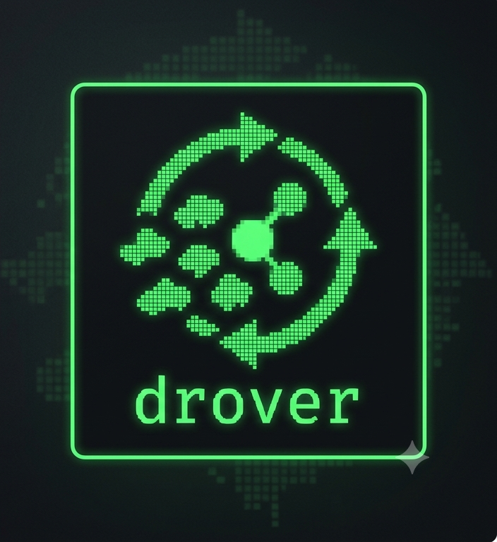

<table>
  <tr>
    <td valign="top"></td>
    <td valign="top">
      <h1>drover</h1>
      <em>drives the flock the shepherd tends.</em>
    </td>
  </tr>
</table>

drover is the sense → assemble-context → act loop **around**
[shepherd](https://github.com/jwarykowski/shepherd). shepherd stays the dumb,
safe blackboard that owns the todo file; drover senses events, reads the
relevant slice of the board, decides, and — when allowed — acts. **It only ever
speaks shepherd's CLI, never the file.** Keep that line clean and everything
else stays swappable.

## status

drover senses upstream events (GitHub PRs, Sentry issues) and shepherd board
changes, parks agent-driven tasks behind a human `hold → go` gate, and — on
release — runs an allowlisted agent in a target repo, reconciling the task from
the agent's structured verdict. Every step sits behind a clean seam.

## the boundary

drover never touches the todo markdown. It speaks shepherd's CLI contract:
stable item ids, `--json` on every mutating verb, structured errors, and `watch`
(NDJSON). `store/shepherd.go` is the **only** file that knows shepherd exists —
the loop sees just interfaces, so shepherd is one swappable `Store`.

## the seams

The loop is a handful of interfaces; everything else is an implementation behind
one.

```go
type Source    interface{ Events(ctx) <-chan Event }                    // sense
type Assembler interface{ Assemble(ctx, Event) (Context, error) }       // attend
type Store     interface{ List / Add / SetStatus / Note / Archive }     // read + write
type Policy    interface{ Decide(ctx, Context) []Action }               // think
type Executor  interface{ Apply(ctx, []Action) error }                  // act
```

`Loop.Run`: **event in → assemble the attention slice → decide actions →
apply.** The loop imports only these interfaces — swap `ShepherdStore` for
`FakeStore` and it can't tell.

Every event carries a sealed `Payload`: a `Signal` (something happened upstream
— repo, title, url) or a `BoardChange` (a shepherd item that changed). A policy
switches on the concrete shape, never on raw gh/Sentry JSON.

Actions are a closed vocabulary — a policy proposes, an executor validates and
applies:

| Action | Effect |
| --- | --- |
| `AddTask` | create an item (idempotent by link) |
| `SetStatus` | transition an item by id (e.g. → `running`, `done`) |
| `RunAgent` | run an agent action from the trusted **registry**, by id |
| `RunAction` | fire a named command from the trusted **allowlist** |

## how it works

Two flows share one loop, split by a `PolicyRouter` that matches on event-type
prefix (first match wins).

**1. upstream signal → held task → human gate → agent run**

```
PR merged / issue opened / sentry issue
  → Ingress matches the event (type [+ repo]) against the registry
  → parks ONE held agentic task per match, carrying the action's id
  → a human flips hold → go in shepherd            # the review gate
  → board.updated → Dispatcher claims `running` + emits RunAgent
  → AgentExecutor resolves the id, runs `claude` in the action's target repo
  → reconciles the task (done / left running) from the agent's verdict
```

The hold→go gate is the whole safety story: an agent never runs on untrusted
event text until a human releases it.

**2. board change → trusted action**

```
board.{added,updated,removed,archived}   # from `shepherd watch`
  → BoardTrigger matches human-authored items by type against the registry
  → added/updated fire on the live item and reconcile a verdict
  → removed/archived are terminal — fire-and-forget off the event payload
```

The `board.` route is a `Chain`: `Dispatcher` (agentic tasks, gated) then
`BoardTrigger` (human-authored items). The catch-all route is `Ingress`.

Sensing is fanned in by `source.Merge`: the GitHub sense (push via
`gh webhook forward`, or poll) plus `WatchSource` (shepherd's NDJSON stream)
drive the same loop, both deduped on event id (`--seen` persists across
restarts). Agent runs go through a bounded worker pool (`--agents N`) so a long
run never blocks sensing.

## layout

```
drover/
  cmd/drover/main.go     watch | action | run | doctor
  loop/loop.go           the seams + Loop wiring (interfaces only)
  store/shepherd.go      CLI adapter — the only file that knows shepherd
  store/locking.go       serialises concurrent shepherd calls (file-locked)
  store/fake.go          in-memory Store for tests
  context/assembler.go   WorkingContext — the attention slice
  registry/registry.go   the trusted registry of agent actions (RunAgent)
  policy/router.go       PolicyRouter (prefix match) + Chain
  policy/ingress.go      signal → held agentic task, via the registry
  policy/dispatch.go     released agentic task → RunAgent (gated hold→go)
  policy/boardtrigger.go human-authored board change → RunAgent, by type
  source/github.go       poll merged PRs
  source/webhook.go      gh webhook forward receiver (push)
  source/sentry.go       poll new Sentry issues
  source/watch.go        WatchSource — NDJSON over `shepherd watch`
  source/merge.go        fan several sources into one stream
  source/dedup.go        drop already-handled event ids (mem / file)
  exec/router.go         RouterExecutor — routes actions to the right executor
  exec/store.go          StoreExecutor — board mutations, idempotent by link
  exec/agent.go          AgentExecutor — worker pool, runs `claude`, reconciles
  exec/runner.go         RunnerExecutor — allowlisted commands, never board-shell
  config/config.toml     the RunAction allowlist (for `drover run`)
```

## trusted config

drover keeps two trusted stores, both **outside** the board — so board content
can never name a command body, only a key:

- **the registry** (`drover action …`, `~/.config/drover/actions.toml`)
  — agent actions for `RunAgent`. Each row is a stable `id`, an event `on:` to
  match, an optional `repo:` filter, the `target:` directory, a claude `mode:`,
  and the prompt `do:`. The board references an action by id only.
- **the allowlist** (`config/config.toml`) — named commands for `RunAction`,
  fired by `drover run`. Args substitute as whole argv elements (no shell), with
  a confirm gate and a provenance record.

## build

```sh
go build ./...
go test ./...                       # hermetic unit tests
go test -tags integration ./store/  # round-trip against a real shepherd binary
```

Runtime needs `shepherd`, `gh`, and `claude` on `PATH` (the integration test
needs `shepherd`; watching GitHub needs `gh`; agent runs shell `claude`).

## usage

```sh
# prove the boundary: read the board, add a throwaway
drover doctor --project <board>

# register an agent action the board can trigger (prompt via $EDITOR)
drover action add --name fix-ci --on github.pull_request.merged \
  --repo acme/api --target ~/src/acme-api --mode acceptEdits

# sense GitHub + the board and drive the loop (push by default; --source poll)
drover watch --repo acme/api --project <board> --agents 2 \
  --seen ~/.local/state/drover/seen --provenance ~/.local/state/drover/prov.jsonl

# fire an allowlisted named command directly
drover run fix-ci --arg repo=acme/api --arg task="fix the failing run" --yes
```

`drover action list|edit|rm` manage the registry; edits take effect on the next
event without restarting `watch` (the registry reloads per event).

## design principles

- **Never exec strings from the board.** The synced, hand-editable file is
  untrusted input. The executor takes action *names/ids* resolved against
  trusted config — never command bodies from item fields.
- **Address items by id, never index.** Indices shift as the board reorders;
  ids never do.
- **Policy is a pure function of context.** No I/O in `Decide` — table-testable,
  and a new policy drops in behind the same interface.
- **Gate before acting.** An agent runs on event-derived text only after a human
  flips the task `hold → go`; the executor validates every action against a
  fixed vocabulary first.

## non-goals (v1)

- no perception — "sensing" means structured events (GitHub / Sentry / webhooks
  / board watch).
- no ML inside drover — the intelligence lives in the agent it invokes; drover
  keeps clean, queryable history via shepherd.
- no reimplementation of shepherd's storage — drover never owns the file.
