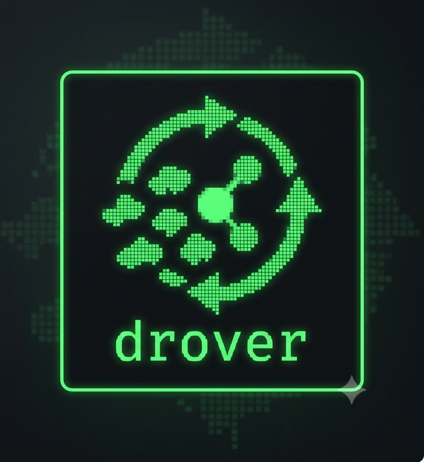

<table width="100%">
<tr>
<td valign="top" width="140">

</td>
<td valign="top">

# 🐕 drover

> drives the flock, whoever tends it.

drover is the sense → match → act loop. A **source** ingests events over one
small protocol, an **action** matches one, and whichever **runner** that action
names runs against it. Sources are separate processes, so adding one is a
config row — drover never learns what GitHub, Sentry or a todo board *is*.

</td>
</tr>
</table>

- [quickstart](#quickstart)
- [status](#status)
- [the shape](#the-shape)
- [the event protocol](#the-event-protocol)
- [writing a source](#writing-a-source)
- [runners](#runners)
- [config](#config)
- [how it works](#how-it-works)
- [layout](#layout)
- [build](#build)
- [usage](#usage)
- [design principles](#design-principles)
- [non-goals](#non-goals)

## quickstart

```sh
# 1. tell drover what to ingest and what to run (see config below)
$EDITOR ~/.config/drover/drover.toml

# 2. check the wiring: transports, binaries, actions
drover doctor

# 3. teach drover what to do when an event lands
drover action

# 4. sense and drive the loop
drover watch
```

An event lands → drover parks **one held run**. Open the dashboard, flip it
`hold → go`, and the action's runner runs in its target directory, marking
the run done from its verdict — each run logged as a JSON line on stdout.
Nothing runs until you release it, unless the action opts into `auto`.

Or skip the flags: run **`drover`** for the dashboard. Move across the
held/running/done lanes with the arrow keys (or `j`/`k`), `g` to release a held
run, `x` to delete one, `b` to filter by source, `l` for the full-window daemon
trace, and `d` (or `enter`) for a run's **detail view** — its verdict and status,
with `l` opening the agent's full conversation log (tailed live, persisted at
`~/.config/drover/logs/<task-id>.jsonl`), `r` to restart and `x` to delete.

## status

Works end to end: both transports, the `hold → go` review gate, the agent run,
and reconcile-from-verdict. Every step sits behind a seam; see
[how it works](#how-it-works).

## the shape

```
source (exec | http) → event → match action → run named runner → verdict → reconcile
```

Five interfaces, and everything else is an implementation behind one:

```go
type Source    interface{ Events(ctx) <-chan Event }                // ingest
type Assembler interface{ Assemble(ctx, Event) (Context, error) }   // attend
type Store     interface{ List / Add / SetStatus / Note / Archive } // track
type Policy    interface{ Decide(ctx, Context) []Action }           // think
type Executor  interface{ Apply(ctx, []Action) error }              // act
```

There is exactly one event shape. It is an open map on purpose — a source is a
separate process and cannot add a Go type, so every closed vocabulary would be a
reason to recompile drover:

```go
type Event struct {
	ID, Type, Source string
	At               time.Time
	Data             map[string]string // whatever the source sent
}
```

Actions are a closed vocabulary — a policy proposes, an executor validates and
applies:

| Action | Effect |
| --- | --- |
| `AddTask` | park a run (one per subject+action at a time) |
| `SetStatus` | transition a run by id (e.g. → `running`, `done`) |
| `RunAgent` | run an action from the trusted config, **by id** |

## the event protocol

One JSON object per line. Only `id` and `type` are required.

```json
{"id":"github/acme/api:pr:12:merged","type":"github.pull_request.merged",
 "source":"acme-api","at":"2026-07-30T09:00:00Z",
 "data":{"repo":"acme/api","title":"fix login","url":"https://…","subject":"https://…"}}
```

`id` must be unique **per logical event**, not per subject: two edits to the
same item are two events and need two ids, or drover's dedup swallows the second
one forever.

`data` is free-form — actions filter on it, prompts render it, targets template
from it — but three keys are conventional, because drover itself reads them:

| key | meaning |
| --- | --- |
| `title` | what the run is called in the lanes |
| `url` | a link a human can open |
| `subject` | a **stable** id for the thing this event concerns (a PR url, a board item id, an issue key). While a run for a subject is in flight, further events about that subject don't park a second one. Falls back to `url`, then to the event id. |

Anything else you send reaches the prompt and the action filters untouched.

## writing a source

A source is **any process that writes those lines to stdout**, or any service
that POSTs them. No linking, no ABI, any language.

```sh
#!/bin/sh
# the whole contract
while read -r line; do
  printf '{"id":"tail:%s","type":"log.error","data":{"title":"%s","subject":"errlog"}}\n' \
    "$(date +%s%N)" "$line"
done
```

```toml
[[source]]
name  = "errlog"
cmd   = ["./tail-errors.sh"]
types = ["log.error"]          # optional: populates the action editor's picker
```

drover spawns it, reads its stdout, restarts it if it dies, and dedups on event
id. Its stderr is yours for diagnostics. For a remote source, set
`http = "127.0.0.1:9100"` instead and POST the same body to `/events` —
downstream, an action cannot tell which transport raised an event.

**drover's own GitHub and shepherd sources are exactly this** —
`drover source github` and `drover source shepherd` are ordinary plugins
spawned through the same path, with no privileged route in. That is the proof
the contract is real.

## runners

A runner is an argv template. `{{prompt}}` receives the built prompt and
`{{mode}}` the action's permission mode; a runner with no permission concept just
omits it. Adding another runner is a config row, not a release:

```toml
[[runner]]
name  = "claude"
cmd   = ["claude", "-p", "{{prompt}}", "--permission-mode", "{{mode}}",
         "--output-format", "stream-json", "--verbose"]
modes = ["bypassPermissions", "acceptEdits"]

[[runner]]
name = "codex"
cmd  = ["codex", "exec", "--full-auto", "{{prompt}}"]
```

Each action names the runner it wants (`runner = "codex"`; empty takes the first).
`modes` is that runner's own vocabulary — the action editor offers exactly those,
and a runner declaring none accepts anything, since drover can't know a
third-party tool's flags.

No per-tool output parser is needed. drover looks for a trailing verdict two
ways: a `{"type":"result",…}` streaming event, then the last `{…}` line of
stdout. That covers both common shapes.

```json
{"status":"done|failed|blocked","summary":"…","followups":["task text"]}
```

`done` notes the summary, stamps the run done and archives it. Anything else
leaves it `running` with a note, for you to look at. Followups become plain
tasks. drover never executes a string the agent returns.

## config

One file, `~/.config/drover/drover.toml`, holding three tables. It is the only
trusted store: an event can at most *select* an action that already exists here,
and every command body — a source's argv, a runner's argv — lives here alone.

```toml
[[source]]
name  = "shepherd"
cmd   = ["drover", "source", "shepherd"]
types = ["shepherd.added", "shepherd.updated", "shepherd.removed", "shepherd.archived"]

[[source]]
name  = "acme-api"
cmd   = ["drover", "source", "github", "--repo", "acme/api"]
types = ["github.pull_request.merged", "github.issues.opened"]

[[source]]
name = "sentry"
http = "127.0.0.1:9100"

[[runner]]
name  = "claude"
cmd   = ["claude", "-p", "{{prompt}}", "--permission-mode", "{{mode}}",
         "--output-format", "stream-json", "--verbose"]
modes = ["bypassPermissions", "acceptEdits"]

[[action]]
id     = "019f81be"                # assigned by `drover action`
name   = "fix-ci"
on     = "github.pull_request.merged"
where  = { repo = "acme/api" }     # match ANY event data key, not just repo
runner = "claude"
mode   = "acceptEdits"
target = "~/src/acme-api"          # templated: "{{dir}}", "~/src/{{repo}}"
auto   = false                     # true skips the human gate — read below
do     = "A PR merged. If CI on main is red, open a fix PR."
```

`target` templates from event data, which is how an action follows its event
without drover resolving anything source-specific: the shepherd source puts the
board's working directory in `dir`, so `target = "{{dir}}"` runs the runner
there. A placeholder the event never carried is a hard error — running somewhere
unintended is worse than failing.

Actions are normally managed by `drover action`, not hand-edited. Sources and
runners are yours to write.

### the `auto` flag

`auto = true` runs a runner with file system access on event text, with
no human in the loop. On a source whose text an outsider can write — a GitHub
issue title, a Sentry message — that is a prompt-injection path straight to code
execution. It defaults to `false`, `drover action` warns when it is paired with
a permission-waiving mode, and `drover doctor` flags it. Use it only for a
source whose content you control end to end.

## how it works

```
event lands (exec plugin stdout, or an HTTP POST)
  → Dedup drops it if that event id was already handled
  → Policy matches type + where against the config
  → parks ONE held run per matching action, carrying the action's id
  → a human flips hold → go in the dashboard            # the review gate
  → the task store re-drives itself; Policy claims `running` + emits RunAgent
  → AgentExecutor resolves the action, resolves its runner, renders the argv,
    runs it in the templated target directory
  → reconciles the run (done → archived / left running) from the verdict
```

An `auto` action parks straight at `go` instead of `hold`, so the same re-drive
dispatches it on the next tick — one path, not two.

Runs live in `tasks.json`, drover's own store. A source is never written to: a
board item that triggers a run is left exactly as the person set it. Dedup keys
on the event's `subject`, so one subject runs one action at a time and re-fires
only once the previous run is done. Agent runs go through a bounded worker pool
(`--agents N`) so a long run never blocks ingestion.

## layout

```
drover/
  cmd/drover/main.go              CLI: watch | action | source | doctor (bare = dashboard)
  cmd/drover/source_github.go     `drover source github` — a plugin, not a built-in
  cmd/drover/source_shepherd.go   `drover source shepherd` — the ONLY file that knows shepherd
  daemon/daemon.go                composition root: config → sources → loop
  loop/loop.go                    the seams + Loop wiring (interfaces only)
  config/config.go                drover.toml: [[source]], [[runner]], [[action]]
  context/assembler.go            WorkingContext — the attention slice
  policy/policy.go                match → park, and re-drive → dispatch
  source/wire.go                  the event envelope, encode + decode
  source/exec.go                  ExecSource — spawn a plugin, read NDJSON
  source/http.go                  HTTPSource — accept POSTed NDJSON
  source/merge.go                 fan several sources into one stream
  source/dedup.go                 drop already-handled event ids (mem / file)
  exec/router.go                  RouterExecutor — routes actions to the right executor
  exec/store.go                   StoreExecutor — task mutations, one per subject+action
  exec/agent.go                   AgentExecutor — worker pool, resolves + runs any tool
  exec/template.go                {{key}} substitution, fail-closed
  store/file.go                   tasks.json + the re-drive that makes it a Source
  store/fake.go                   in-memory Store for tests
  tui/dashboard.go                dashboard: lanes, source filter, watch control, trace
  tui/action.go                   interactive action authoring
  tui/form.go                     the picker + editor widgets
  tui/detail.go                   read-only action detail
```

## build

```sh
go build ./...
go test ./...
```

Runtime needs whatever your sources and runners name — nothing more. The shipped
shims want `shepherd` and `gh`; the example runner wants `claude`.
`drover doctor` tells you which are missing.

## usage

```sh
# the dashboard: work the lanes, filter by source, start/stop the watch
drover

# check the wiring without changing anything
drover doctor

# author an action interactively
drover action

# …or scripted (prompt via $EDITOR)
drover action add --name fix-ci --on github.pull_request.merged \
  --where repo=acme/api --runner claude --target ~/src/acme-api --mode acceptEdits

drover action list
drover action edit <id> --runner codex
drover action rm <id>

# sense and drive the loop — no flags needed; drover.toml defines everything
drover watch

# tail the per-run trace only (stdout), pretty-printed
drover watch 2>/dev/null | jq -c

# persist the dedup set and tee the trace
drover watch --agents 2 \
  --seen ~/.local/state/drover/seen --provenance ~/.local/state/drover/prov.jsonl

# run a source plugin by hand, to see what it emits
drover source github --repo acme/api --mode poll
drover source shepherd --all
```

Two output streams keep machine trace and human log apart:

- **stdout** — the structured trace: one JSON record per agent run (`at`,
  `action`, `runner`, `task`, `target`, `status`, `summary`, `outcome`).
- **stderr** — the operational log: ingestion, parking, errors.

## design principles

- **Never exec a string from an event.** Event content is untrusted input. The
  executor takes action *ids* resolved against trusted config — never a command
  body from an event field.
- **A source is a process, not a type.** If adding one needs a Go change, the
  seam is in the wrong place.
- **Address by id, never index.** Indices shift; ids never do.
- **Policy is a pure function of context.** No I/O in `Decide` — table-testable.
- **Gate before acting.** An agent runs on event-derived text only after a human
  releases it, unless an action explicitly opts out.

## non-goals

- no perception — "sensing" means structured events.
- no ML inside drover — the intelligence lives in the tool it invokes; drover
  keeps clean, queryable history.
- no storage drover doesn't own — a source is read, never written.
