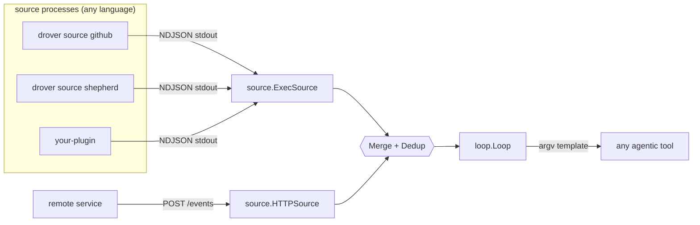
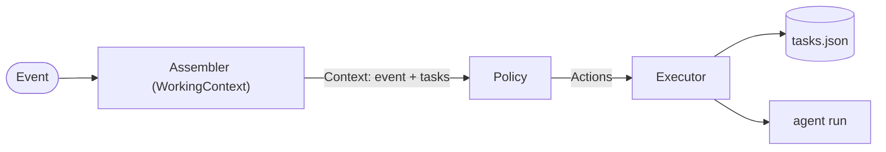
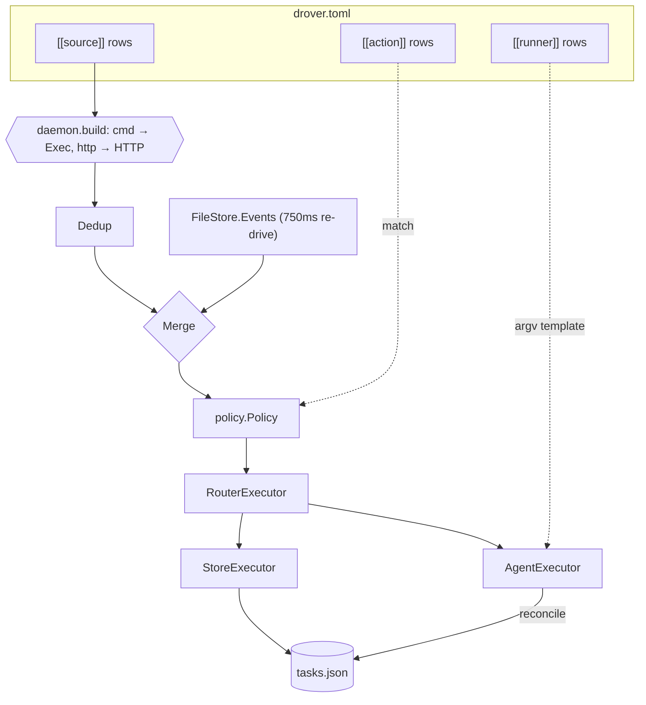
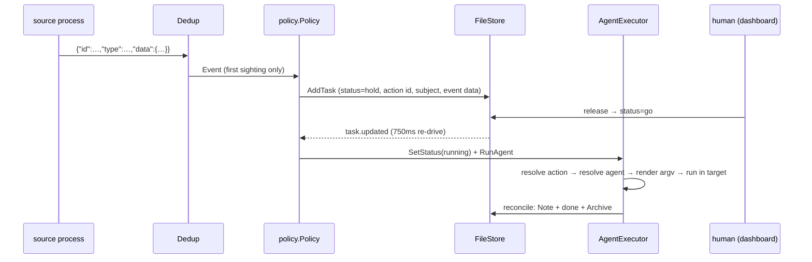

# drover architecture

drover is the **sense → match → act** loop. A source ingests events over one
small protocol, an action matches one, and whichever agentic tool that action
names runs against it.

The organising idea: **drover knows nothing about any particular source or any
particular tool.** A source is a separate process speaking one line-oriented
protocol; a tool is an argv template. Both live in config, so adding either is a
row in a file rather than a release.

- [the boundary](#the-boundary)
- [the seams](#the-seams)
- [the event protocol](#the-event-protocol)
- [runtime wiring](#runtime-wiring)
- [data flow](#data-flow)
- [the trust boundary](#the-trust-boundary)
- [package layout](#package-layout)

## the boundary

Two lines matter, and neither has a vendor on the inside.

**Sources.** drover holds a `loop.Source` and cannot tell what is behind it. A
local plugin is a spawned process read over stdout; a remote one POSTs the same
bytes. drover's own GitHub and shepherd support are ordinary plugins
(`drover source github`, `drover source shepherd`) spawned through the very same
path — they have no privileged route in, which is what keeps the contract
honest.

**Agents.** drover holds an argv template and substitutes two values into it. It
has no idea whether that runs claude, codex, or a shell script.



`cmd/drover/source_shepherd.go` is the only file in the repo that knows shepherd
exists. Drop it and drover still works; nothing else references it.

## the seams

The loop wires five interfaces (`loop/loop.go`) and imports only these.

| seam | question | implementations |
|---|---|---|
| `Source` | what happened? | `ExecSource`, `HTTPSource`, `FileStore`, `Merge`, `Dedup` |
| `Assembler` | which tasks are relevant? | `context.WorkingContext` |
| `Store` | track the run | `FileStore` (JSON), `FakeStore` (tests) |
| `Policy` | what should we do? | `policy.Policy` |
| `Executor` | apply it | `RouterExecutor` → `StoreExecutor` / `AgentExecutor` |



One event drives one pass: `Assemble → Decide → Apply` (`loop.Loop.Run`).

There is **one event shape**, with an open `Data map[string]string`. That is
load-bearing rather than lazy typing: a source is a separate process and cannot
add a Go type, so a sealed payload union would make every new source family a
drover code change. The same reasoning retired the compiled-in list of event
types — sources declare their own now, and the action editor reads that.

## the event protocol

```json
{"id":"shepherd:updated:a1:1753…","type":"shepherd.updated","source":"shepherd/work",
 "at":"2026-07-30T09:00:00Z","data":{"title":"fix ci","subject":"a1","dir":"/src/work"}}
```

Required: `id`, `type`. Defaulted: `at` (receipt time), `source` (the config
row's name), `data` (empty).

`id` is the dedup key and must be unique **per logical event**. Two edits to one
item are two events; reusing an id would have `Dedup` swallow every edit after
the first. Recurrence is expressed with `subject` instead — a stable id for the
thing the event concerns, which keeps one run per subject in flight without
hiding later changes. A missing `id` is rejected rather than synthesised: a
synthetic one would silently defeat dedup and re-fire everything on each restart.

Three conventional keys (`title`, `url`, `subject`) are the only ones drover
reads. Everything else flows through to the prompt, the `where` filter and the
`target` template untouched.

## runtime wiring

`daemon.Run` is the composition root — deliberately outside `tui`, so a headless
`drover watch` and the source shims link none of the terminal machinery. It
builds every source from config, fans them into one stream, and drives a
**single loop**.



Notes:

- **One loop, one store, one policy.** The previous design ran two concurrent
  loops (one for upstream events, one for the board) with three policies and a
  prefix router. With a single event shape they collapse: `policy.Policy`
  handles a re-drive as a dispatch and everything else as a match.
- **`FileStore` is both a `Source` and a `Store`.** A 750 ms ticker re-drives
  each open task as a `task.updated` event carrying only the task id, so a
  `hold → go` release dispatches within a tick. The policy resolves the task's
  *live* status from the store, so replaying an already-claimed task is a no-op.
- **The re-drive is not deduped.** It replays the same id every tick by design;
  `Seen` would swallow every replay after the first. Only configured sources are
  wrapped in `Dedup`.
- **Config reloads per event**, so `drover action add|edit|rm` take effect in a
  running daemon. Source rows are not re-read — a source is a running process,
  so adding one needs a restart.
- **A bad source row is skipped, not fatal.** A row setting neither transport
  (or both) is logged and dropped; every other source still runs.
- **One `AgentExecutor`, one worker pool** (`--agents` goroutines), so a long
  run never blocks ingestion.
- **Dedup / re-fire:** a parked run carries the event's `subject`, and
  `StoreExecutor` skips a park whose `Subject`+`Action` matches an *active* run.
  One subject runs one action at a time, re-firing only once the previous run is
  done. Two different actions on one subject are two runs.
- **Per-job logs.** `AgentExecutor` tees the whole run (stdout + stderr) to
  `<LogDir>/<taskID>.jsonl` (default `~/.config/drover/logs`), timestamping each
  line — not every tool stamps its own stream events. The dashboard's detail
  view shows the verdict; `l` opens the full conversation log, tailed live. From
  there `r` restarts the run (re-queued at `hold`, stale log cleared) and `x`
  deletes it. Completed runs are archived off the live list but still surface in
  the `done` lane.

## data flow

### the whole path



An action marked `auto` parks at `go` rather than `hold`, so the same re-drive
dispatches it on the next tick. There is deliberately no separate auto-fire
branch to keep correct.

### where the agent runs

`target` is a template over the event's own data, which is how an action follows
its event without drover resolving anything source-specific:

| target | resolves to |
|---|---|
| `~/src/acme-api` | that literal path |
| `~/src/{{repo}}` | the repo the event named |
| `{{dir}}` | whatever directory the source put in `dir` |

The shepherd shim reads `shepherd boards --json` once per stream and puts the
board's working directory in every event's `dir`, so `target = "{{dir}}"` runs
the agent in the board's own directory — with drover itself knowing nothing
about boards. A placeholder the event never carried is a hard error: running
somewhere unintended is worse than failing.

## the trust boundary

drover never runs a string sourced from an event. What an agent *does* comes
only from `drover.toml`, keyed by action id; event text is fenced into the
prompt as **data, not instructions**.

- Every command body — a source's argv, an agent's argv — lives in config alone.
  An event can at most *select* an action that already exists.
- Parked runs carry untrusted upstream text, so they wait at `hold` and fire
  only after a human flips `hold → go`.
- **`auto = true` waives that gate.** An agentic tool with file system access
  then acts on event text with no human in the loop; on a source whose text an
  outsider can write, that is prompt injection to code execution. It defaults to
  false, `drover action` warns when it is paired with a permission-waiving mode,
  and `drover doctor` flags it.
- Template rendering fails closed. Event data (the untrusted path) is rejected
  if it carries a newline or NUL. The agent argv path allows newlines — a prompt
  is multi-line by construction — which is safe for a different reason: each
  element becomes one execve argument with no shell and no re-parsing, so a
  newline cannot become a second argument. NUL is still rejected, since it would
  truncate the argument.
- Prompt values are flattened to one line each, so a multi-line value cannot
  forge extra context rows or a second `TASK:` line.
- The agent's verdict maps only onto a fixed vocabulary (`done` / note / add
  follow-up). drover never executes what the agent returns.

## package layout

| package | role |
|---|---|
| `loop` | the seam interfaces + `Loop.Run`; imports nothing internal |
| `config` | `drover.toml`: sources, runners, actions; match, resolve, save |
| `context` | `WorkingContext` assembler (event → task slice) |
| `policy` | `policy.Policy`: match → park, re-drive → dispatch |
| `source` | the wire envelope, `ExecSource`, `HTTPSource`, `Merge`, `Dedup`, `Seen` |
| `exec` | `AgentExecutor`, `StoreExecutor`, `RouterExecutor`, `{{key}}` templating |
| `store` | `FileStore` (JSON + re-drive), `FakeStore` (tests) |
| `daemon` | composition root: config → sources → loop |
| `tui` | dashboard, action manager, form widgets |
| `cmd/drover` | CLI entrypoint plus the two shipped source plugins |
