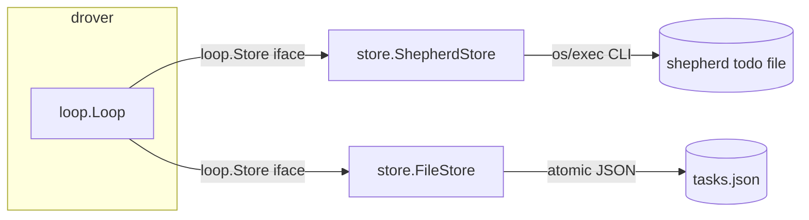
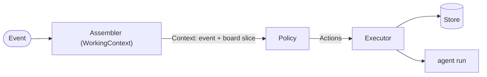
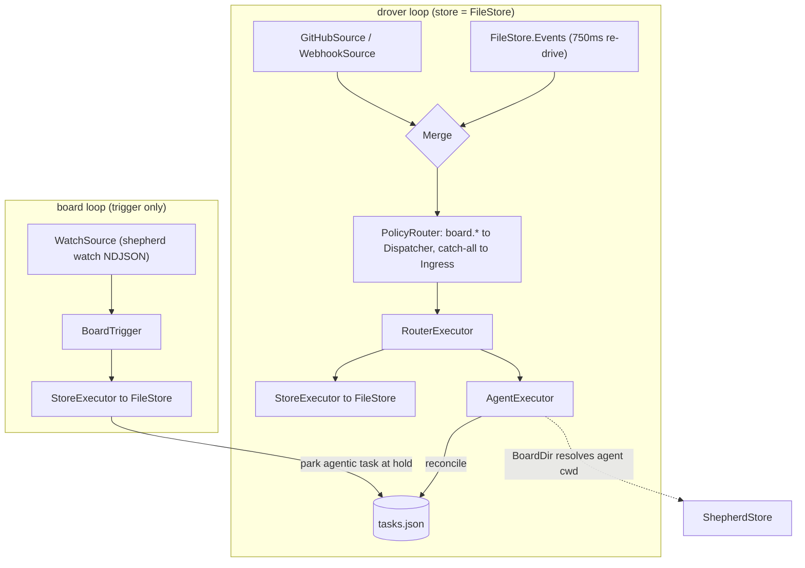
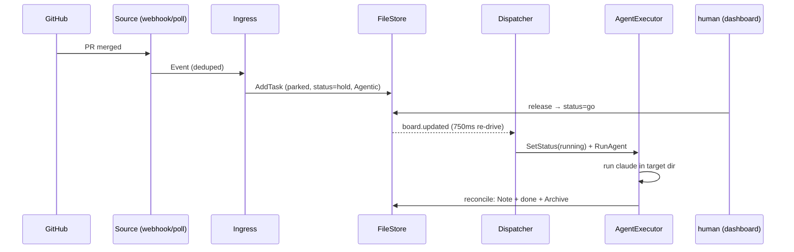
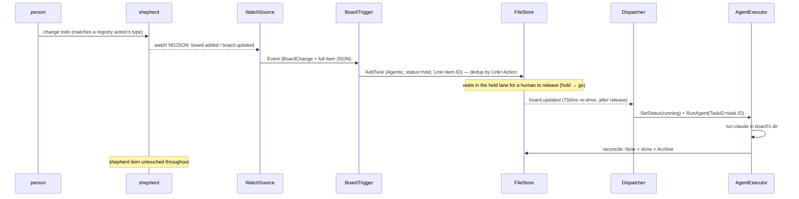

# drover architecture

drover is the **sense → assemble-context → act** loop *around*
[shepherd](https://github.com/jwarykowski/shepherd). shepherd owns the todo
file and stays a dumb, safe blackboard; drover senses events, reads the relevant
slice of a board, decides, and — when allowed — runs an agent. drover speaks
shepherd's CLI, never its file.

- [the boundary](#the-boundary)
- [the four seams](#the-four-seams)
- [the two task worlds](#the-two-task-worlds)
- [runtime wiring](#runtime-wiring)
- [data flow](#data-flow)
- [the trust boundary](#the-trust-boundary)
- [package layout](#package-layout)

## the boundary

Everything crosses one line: `loop.Store`. drover holds a `Store` interface and
cannot tell which implementation it is. shepherd is reached over `os/exec`
(`store.ShepherdStore`); drover's own tasks live in a JSON file
(`store.FileStore`). Swap either without touching a policy.

## the four seams

The loop wires four interfaces (`loop/loop.go`) and imports only these — every
component is an implementation behind one of them.

| seam | question | implementations |
|---|---|---|
| `Source` | what happened? | `WebhookSource`, `GitHubSource`, `WatchSource`, `FileStore`, `Merge`, `Dedup` |
| `Assembler` | what's the relevant board slice? | `context.WorkingContext` |
| `Policy` | what should we do? | `Ingress`, `Dispatcher`, `BoardTrigger`, `PolicyRouter` |
| `Executor` | apply it | `RouterExecutor` → `StoreExecutor` / `AgentExecutor` / `RunnerExecutor` |

One event drives one pass: `Assemble → Decide → Apply` (`loop.Loop.Run`).

## the two task worlds

An agentic run is born two ways, but **both live in one store — the `FileStore`
(`tasks.json`)**. shepherd is never written: it is a todo board a person owns and
a pure *trigger* for drover, nothing more. This is the core decision:
**everything drover runs is tracked and reconciled in `tasks.json`, so the board
stays the human's and the dashboard sees every run in one place.**

| | drover-sensed runs | board-triggered runs |
|---|---|---|
| origin | github / sentry event | a person changes a todo on a board |
| store (run state) | `FileStore` (`tasks.json`) | `FileStore` (`tasks.json`) |
| the shepherd item | — | **never touched** (stays as the human set it) |
| parked at | `hold`, human flips `go` | `hold`, human flips `go` |
| parked by | `Ingress` | `BoardTrigger` |
| fired by | `Dispatcher` | `Dispatcher` |
| completion written to | `tasks.json` | `tasks.json` |

Both worlds converge on the same park → release → `Dispatcher` → reconcile path
once the task is in the `FileStore`; they differ only in what parks the task.
Both park at `hold` and wait for a human to release them (`hold → go`) — board
triggers are a queue of suggested runs, not auto-fired.

## runtime wiring

`tui.RunDaemon` runs **two concurrent loops** until the context is cancelled,
both writing to the one `FileStore`. The board loop only *parks* a task; the
drover loop's `Dispatcher` (fed by the store's own re-drive) fires it and the
single `AgentExecutor` reconciles it.

Notes:

- **`FileStore` is both a `Source` and a `Store`.** A 750 ms ticker re-drives
  each open task as a `board.updated` event, so a `hold → go` release dispatches
  within a tick. `Dispatcher` reads the task's
  *live* status (not the event's), so replaying an already-claimed task is a
  no-op — idempotent.
- **shepherd's only roles** are as a trigger `Source` (`shepherd watch`) and
  `BoardDir`: resolving an action's target board to the agent's working dir. It
  is read, never written.
- **Watch scope.** A selected board runs one `shepherd watch --board <name>`.
  The default (no board) watches *all* boards: drover enumerates them
  (`shepherd boards`) and fans out one watch each through `source.Merge`, every
  event pre-tagged with its board. The dashboard tags each run with its origin
  board so the lanes can filter to one board or group by board across all. A
  board created mid-run is picked up on the next daemon (re)start.
- **One `AgentExecutor`, one worker pool** (`--agents` goroutines): both worlds
  reconcile to the same `FileStore`, so a single pool suffices.
- **Dedup / re-fire:** a parked board task carries the board item id as `Link`,
  and `StoreExecutor` skips a park whose `Link`+`Action` matches an *active*
  task. So one board item runs one action at a time, and re-fires only once the
  previous run is done.
- **Per-job logs.** `AgentExecutor` runs the agent with `--output-format
  stream-json --verbose` and tees the whole turn (stdout + stderr) to
  `<LogDir>/<taskID>.jsonl` (default `~/.config/drover/logs`). The dashboard's
  job detail view shows the run's verdict; `l` opens the agent's full
  conversation log as its own window, tailed live for a running job. From the
  detail view `r` restarts the run (re-queued at `hold`, its stale log cleared)
  and `x` deletes it (task and log) — key bindings mirror shepherd (`d` detail,
  `x` delete). Completed runs are archived off the live
  list but still surface in the `done` lane (their log persists by id).

## data flow

### drover-sensed task (github → agent → tasks.json)

### board-triggered run (board change → drover task → tasks.json)

The shepherd item is only ever read; the run is parked, fired and reconciled
entirely in `tasks.json`, so the person's todo is left exactly as they set it.

## the trust boundary

drover never runs a string sourced from a board. What an agent *does* comes only
from the trusted registry (`~/.config/drover/actions.toml`), keyed by action id;
event text is fenced into the prompt as **data, not instructions**.

- `Ingress`-parked tasks carry untrusted upstream text, so they park at `hold`
  and fire **only** after a human flips `hold → go`.
- `BoardTrigger` also parks at `hold`: a board change queues a run for the
  operator to release manually, never auto-fired. The parked task is agentic and
  drover-owned — the run never writes back to the person's board.
- The agent's verdict maps only onto a fixed vocabulary (`done` / note / add
  follow-up). drover never executes what the agent returns.

## package layout

| package | role |
|---|---|
| `loop` | the four seam interfaces + `Loop.Run`; imports nothing else |
| `context` | `WorkingContext` assembler (event → board slice) |
| `policy` | `Ingress`, `Dispatcher`, `BoardTrigger`, `PolicyRouter` |
| `source` | `WebhookSource`, `GitHubSource`, `WatchSource`, `Merge`, `Dedup`, `Seen` |
| `exec` | `AgentExecutor`, `StoreExecutor`, `RunnerExecutor`, `RouterExecutor` |
| `store` | `ShepherdStore` (CLI adapter), `FileStore` (JSON), `FakeStore` (tests) |
| `registry` | the trusted action allowlist |
| `tui` | dashboard, action manager, and `RunDaemon` (the two-loop wiring) |
| `cmd/drover` | CLI entrypoint: `watch` / `action` / `run` / `doctor` |
